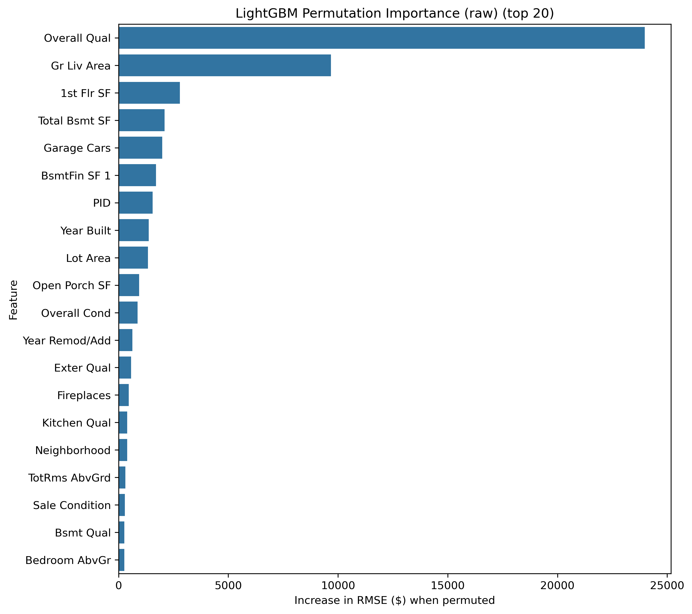

# 🏡 Ames Housing Prices — Machine Learning Regression Project

## 📌 Overview
This project uses the **Ames Housing dataset** (a well-known Kaggle dataset) to predict house sale prices based on various property features.  
The pipeline includes advanced feature engineering, preprocessing, model selection (linear models, tree ensembles, and gradient boosting), hyperparameter tuning via GridSearchCV,
and performance evaluation on a holdout set.

The best model achieved **RMSE ≈ $22.7k** on the holdout set.
---

## 📊 Dataset

- Source: [Ames Housing dataset](https://www.kaggle.com/c/house-prices-advanced-regression-techniques)
- Size: ~2.9K observations (train + test combined)
- Target variable: `SalePrice` (USD)

Main preprocessing steps:
- Dropped columns with >90% missing values
- Feature engineering: `TotalSF`, `HasGarage`, `HasBasement`, log-transform on skewed features
- OneHotEncoder for categorical variables, PowerTransformer + StandardScaler for numerical

---

## ⚙️ Project structure
```
housing_prices/   
├─ data/                    # raw and processed datasets (ignored in git)
├─ notebooks/               # Jupyter notebooks for experiments
│  └─ housing_prices.ipynb 
├─ src/                     # source code (preprocessing, features, models)
├─ models/                  # saved trained models (.joblib)
├─ plots/                   # visualizations (residuals, feature importance)
├─ experiments_log.csv      # experiment history
├─ README.md                # project documentation
├─ requirements.in / .txt   # dependencies
├── environment.yml         # conda environment
└─ .gitignore
```
---

## 🧪 Pipeline Overview

1. **Feature Engineering** – creation of `TotalSF`, binary garage/basement flags, log-transform of skewed features ### (?!)
2. **Preprocessing** – imputing missing values, encoding categorical features, scaling numeric values  
3. **Modeling** – training and hyperparameter tuning (GridSearchCV, 5-fold CV)  
4. **Evaluation** – RMSE, MAE, R² on holdout set  
5. **Feature Importance** – permutation importance and visualization
6. **Outlier experiment** – tested removal of extreme values and re-trained models.

---

## 🥇 Model Leaderboard
All models were trained using a unified pipeline with preprocessing and feature engineering.  
Hyperparameter tuning was performed via **GridSearchCV (5-fold CV)**, results logged in `experiments_log.csv`.

| Model         |   CV RMSE ($) |   Test RMSE ($) |   MAE ($) |     R² |
|:--------------|--------------:|----------------:|----------:|-------:|
| CatBoost      |       22809.9 |         22748.8 |   13796.2 | 0.9355 |
| XGB           |       24396.2 |         23127   |   14008.9 | 0.9333 |
| LightGBM      |       24338.4 |         26107.6 |   14947.1 | 0.915  |
| RandomForest  |       27425.4 |         26621.8 |   15804.8 | 0.9116 |
| XGB (cleaned) |         ---   |         27160.7 |   13928.7 | 0.908  |
| Ridge         |       30062.6 |         31011.9 |   18624.9 | 0.88   |
| Lasso         |       31078.2 |         31371.3 |   18815.4 | 0.8772 |

✅ **CatBoost** achieved the best RMSE on the holdout set.
- Residuals (CatBoost)  
  .png)

- Permutation Importance  
    
  

---
## 🛠️ Environment

To reproduce the results:

```bash
conda env create -f environment.yml
conda activate housing
jupyter lab
---
```
## 🚀 Next Steps 

```markdown
## 🚀 Next Steps

- Try target log-transform to reduce error variance
- Apply regularization and feature selection techniques
- Advanced ensembling (Stacking / Blending)
- Automate feature pipeline (move to `src/` modules)
- Deployment candidate with `FastAPI` or `Streamlit`
